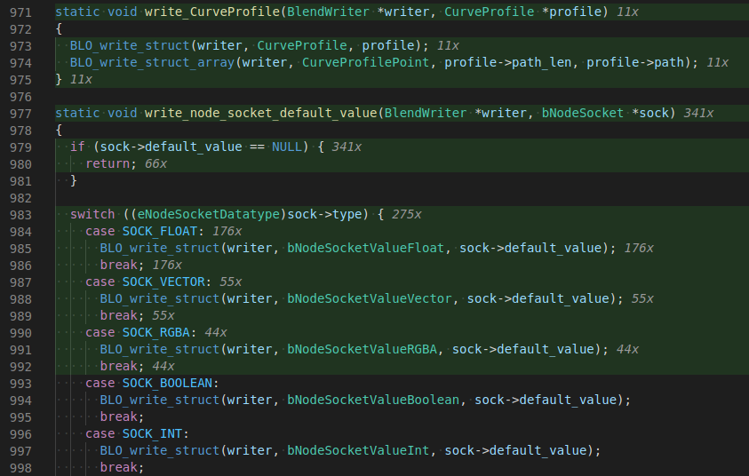
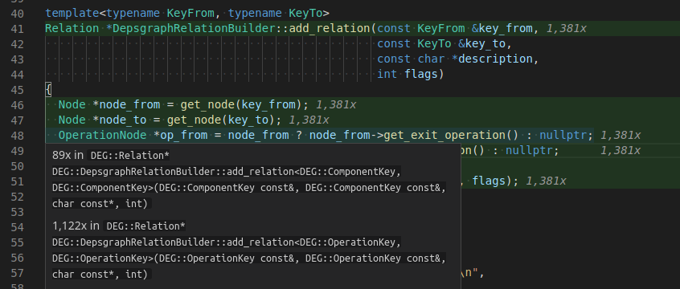

# Gcov Viewer

[Gcov](https://gcc.gnu.org/onlinedocs/gcc/Gcov.html) is a tool you can use in conjunction with GCC to test code coverage in your programs. This extension visualizes the output of gcov in Visual Studio Code. It allows you to see which lines of the program have been executed and how often.

## Usage

1. Compile your code with `gcc`/`g++` (version >= 9) with `--coverage` and without optimizations.
2. Run your program or tests.
3. Open a source file in vscode and use `ctrl+shift+P` to run the `Gcov Viewer: Show` command.

During compilation, `gcc` will generate a `.gcno` file next to every `.o` file. When you run the program, it will create `.gcda` files in the same location. Those contain information about how often functions and lines have been executed.

This vscode extension uses the `gcov` program to parse these additional files and displays the information on top of your source files. For this to work, it has to find the generated `.gcda` for a given project. Those are usually in your build directory. If the extension does not find them on its own, you have to edit the `gcovViewer.buildDirectories` setting of your workspace folder. The most convenient way to do this is to use the `Gcov Viewer: Select Build Directory` command.

## Known Issues

- Sometimes lines are counted more than once when they do more than one thing. That might be confusing in some cases. Usually it is quite easy to get the correct number by looking at neighboring lines.
- When the `Highlight Missed Lines` setting is enabled, some missed lines might not be marked as such.

## Limitations

- Only works with version 9 or higher of `gcc`, `g++` and `gcov`. If you have multiple versions of `gcov`, you might have to change the `Gcov Binary` setting.

## Screenshots

